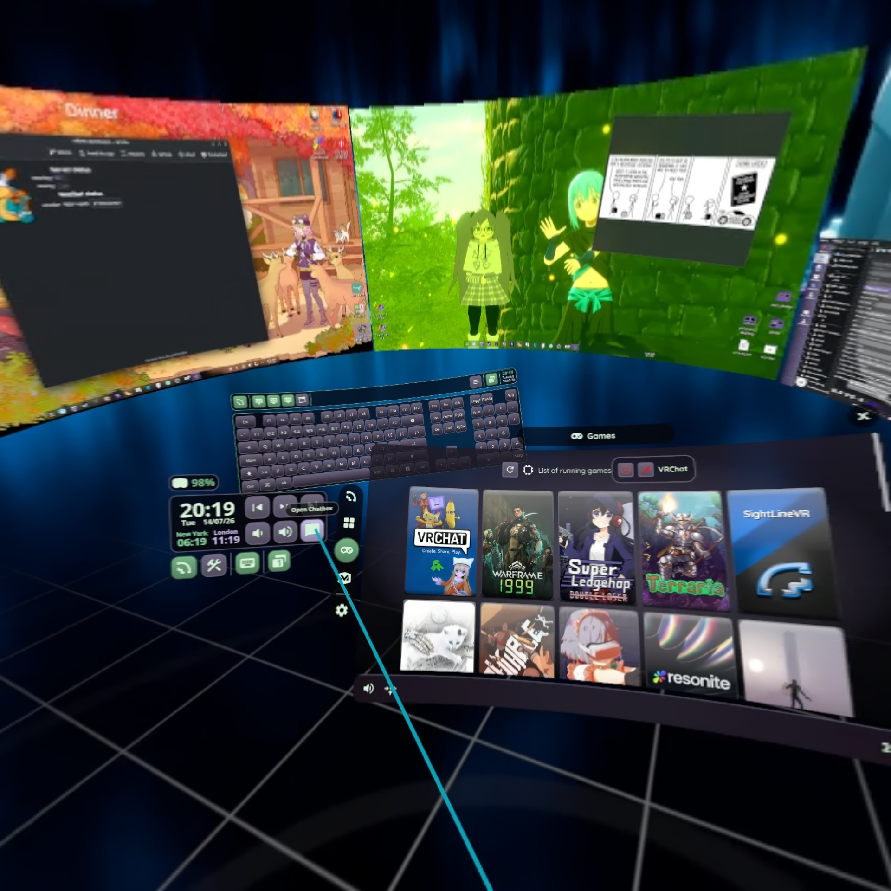

# wayvr

Lightly edited layout, theme, and configs for WayVR.

Contained here are the following:
- [conf.d](conf.d)
  - Includes my main config file, plus extras to set timezones, font, and custom skybox.
- [theme](theme)
  - Lightly edited watch layout with media controls. Some things to keep in mind:
    - `wpctl` is used for the Volume controls.
    - `playerctl` is used for Media controls.
    - Icon paths are relative to this `theme` directory.
  - [quick-chat panel](theme/gui/quick-chat.xml)
    - A custom panel with OSC buttons that send quick-chat messages to VRChat's Chatbox. ([#388](https://github.com/wlx-team/wayvr/pull/388)).
- [sound](sound)
  - Some custom sounds I made. ([#379](https://github.com/wlx-team/wayvr/pull/379))
  - Extra sounds are in the `off` subfolder; for these I preferred the original sounds.
  - There is a list of IDs with descriptions for the context of the sound each file replaces.
- [aurorasky](aurorasky.dds)
    - A default SteamVR Void background converted to DDS format, since I wanted a darker skybox and finding a different one turned out to be more effort than I could be bothered with when this one was already perfect.
- [openxr_actions](openxr_actions.json5)
    - I changed the Oculus controller profile (Oculus/Meta/PICO devices)
      - Other profiles are not included; don't replace yours with mine if you have different controllers.
    - Show/Hide Working Set - Left Menu
    - Space Drag - Left Joystick Click or Right Joystick Click.
    - Space Reset - Double Left Joystick Click.
- [pollhw](pollhw.sh)
  - A script to poll hardware stats like CPU/GPU usage and temperatures. Currently unused due to the UI refresh; I need to re-create my performance overlay.
